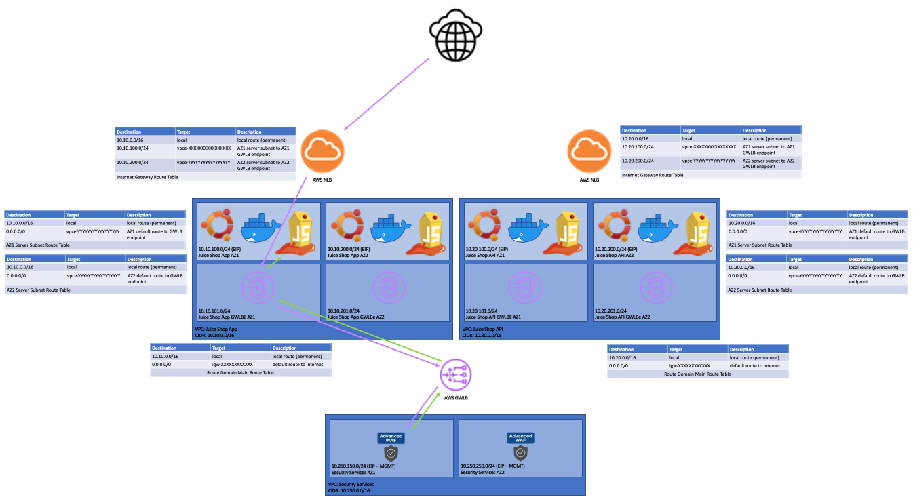

# F5 BIG-IP Terraform Plan for Amazon Web Services Gateway Load Balancer

## Overview
This Terraform plan deploys a proof-of-concept environment for the F5 BIG-IP VE deployed in an AWS Gateway Load Balancer (GWLB) Configuration.

BIG-IP licensing and configuration is performed via [f5-bigip-runtime-init](https://github.com/F5Networks/f5-bigip-runtime-init).

## Device Access
You can connect to the Ubuntu servers and BIG-IPs via SSH. The BIG-IPs are reachable via HTTPS as well. The default credentials for the BIG-IPs are **admin** / **f5c0nfig123!**. You'll need to use the generated SSH key to connect to the Juice Shop servers using the **ubuntu** username.

**The security group is populated with your detected public IPv4 address by default. If the Terraform plan is executed from a different host, or you want to share your environment with another user, you will likely need to update the security group with the additional administrative public IPs. This plan does not include or deploy any IPv6 services.**

## Diagram



### Inventory:
* EC2 Account
    * BIG-IP 15.1.2.1 EHF AMI (required to deploy this plan; can use Marketplace images soon)
* Security Services VPC
    * Internet Gateway (for mgmt reachability)
    * Security Group (Mgmt Reachability)
    * Main Route Table
    * Availability Zone 1
        * BIG-IP 15.1.2.1
    * Availability Zone 2
        * BIG-IP 15.1.2.1
* Juice Shop Web App VPC
    * NLB w/ Juice Shop server targets
    * Security Group (Mgmt and App Reachability)
    * Main Route Table
    * Ingress Route Table (attached to IGW)
    * Availability Zone 1
        * Egress Route Table
        * Juice Shop App Server (Ubuntu)
            * Juice Shop Container (Docker)
            * EIP for mgmt reachability
    * Availability Zone 2
        * Egress Route Table
        * Juice Shop App Server (Ubuntu)
            * Juice Shop Container (Docker)
            * EIP for mgmt reachability
* Juice Shop Web API VPC
    * NLB w/ Juice Shop server targets
    * Security Group (Mgmt and App Reachability)
    * Main Route Table
    * Ingress Route Table (attached to IGW)
    * Availability Zone 1
        * Egress Route Table
        * Juice Shop API Server (Ubuntu)
            * Juice Shop Container (Docker)
            * EIP for mgmt reachability
    * Availability Zone 2
        * Egress Route Table
        * Juice Shop API Server (Ubuntu)
            * Juice Shop Container (Docker)
            * EIP for mgmt reachability

## Notes
- Security groups will automatically allow connections from the host where the Terraform plan was executed.
- Route tables will steer ingress traffic to the GWLB endpoint, and egress server traffic to the GWLB endpoint. The main route table steers inspected traffic destined for the Internet back to the IGW as a default route.
- GWLB GENEVE tunnel configuration is performed automatically.
- The BIG-IP has a default forwarding virtual server, thus no actions are taken on traffic. The default behavior is that the BIG-IP acts as a virtual forwarder/router.

## Usage

### Deploying the Terraform plan
1. Copy admin.auto.tfvars.example to admin.auto.tfvars and populate all variables with valid values.
2. Execute the "./setup.sh" shell script to deploy.

### Post-deployment BIG-IP Configuration

After the Terraform plan is deployed, several manual configuration steps are required for WAF services. However, traffic will flow through the BIG-IP using GWLB as a default forwarding virtual server was created during the environment stand up.

#### WAF Provisioning

Enable the ASM WAF module before performing any configuration.

1. *System* -> *Resource Provisioning* -> *Application Security (ASM)* _> *Nominal* (causes reboot/restart).

#### WAF Policy Creation

First, we'll create a policy that for blocking attacks. Then we'll create a transparent policy that will act as a default policy for FQDNs not configured with a specific policy.

1. *Security* -> *Application Security* -> *Security Policies*.
2. Click *Create*.
3. Define the policy using the following parameters:
    - Policy Name: **JuiceShopEnforced**
    - Policy Template: **Comprehensive** (Choose OK if presented with the following warning: `Changing the policy template may change some of the settings below. Are you sure you want to continue?`)
    - Policy Builder Learning Speed: **Fast**
4. Click *Save*.
5. In the *Policies List* screen, click on the name of the policy that you've just created.
6. In *General Settings* under *Learning and Blocking*, set the *Enforcement Readiness Period* from the default value of **7** days to **0** days.
7. Click *Save*.
8. Click *Apply Policy*.
9. *Security* -> *Application Security* -> *Security Policies*.
10. Click *Create*.
11. Define the policy using the following parameters:
    - Policy Name: **TransparentDefaultPolicy**
    - Policy Template: **Passive Deployment Policy** (Choose OK if presented with the following warning: `Changing the policy template may change some of the settings below. Are you sure you want to continue?`)
    - Enforcement Mode: **Transparent** (*Passive Mode* should be **unchecked**!)
12. Click *Save*.

#### iRule Creation

1. *Local Traffic* -> *iRules* -> *iRule List*.
2. Click *Create*.
3. Enter **WAF_HTTP_Policy_Assignment** as the name.
4. Paste the following text into the iRule, replacing the FQDNs with those provided in the Terraform output:
```
when HTTP_REQUEST {
    if { [HTTP::host] equals "waf-gwlb-juiceshopapinlb-c35f-22d2d4ce4493a161.elb.us-east-2.amazonaws.com" } {
        ASM::enable /Common/JuiceShopEnforced
    } elseif { [HTTP::host] equals "waf-gwlb-juiceshopappnlb-c35f-52ee3f33da958176.elb.us-east-2.amazonaws.com" } {
        ASM::enable /Common/JuiceShopEnforced
    }
}
```
5. Click *Finished*.

#### Virtual Server Configuration

By default, the BIG-IP forwards all traffic using the **forwarding_vs** virtual server. We'll create specific servers to HTTP traffic.

1. *Local Traffic* -> *Virtual Servers* -> *Virtual Server List*.
2. Click *Create*.
3. Define the virtual server (remember to change the Configuration view drop-down from Basic to Advanced):
    - Name: **HTTP_WAF_Listener**
    - Type: **Standard**
    - Source Address: **0.0.0.0%1/0**
    - Destination Address/Mask: **0.0.0.0%1/0**
    - Service Port: **80 / HTTP**
    - HTTP Profile (Client): **http**
    - VLAN and Tunnel Traffic: **Enabled on...**
    - VLANs and Tunnels: **geneve**
    - Source Address Translation: **None**
    - Address Translation: **Disabled**
    - Port Translation: **Disabled**
    - Default Pool: **geneve-tunnel**
4. Click *Finished*.
5. In the *Virtual Server List*, click on the **HTTP_WAF_Listener** virtual server name.
6. Click *Security* in the menu bar at the top of the *Local Traffic ›› Virtual Servers : Virtual Server List ›› HTTP_WAF_Listener* pane. Select *Policies* from the drop-down.
7. Change the drop-down for *Application Security Policy* to **Enabled...** and select the **TransparentDefaultPolicy** policy.
8. Click *Update*.
9. Click *Resources* in the menu bar at the top of the *Local Traffic ›› Virtual Servers : Virtual Server List ›› HTTP_WAF_Listener* pane.
10. Click *Manage* above the *iRules* list.
11. Assign the *WAF_HTTP_Policy_Assignment* iRule. 
12. Click *Finished*.

## Debugging

bigip-runtime-init logs are sent to /var/log/cloud.

If licensing fails, the initial configuration will not complete successfully. You can re-run the initial configuration using the following commands:

```
cd /config/cloud
bash manual_run.sh
```

## Errors
There is a known issue in the AWS provider where EIPs cannot be configured because the ENI is not ready yet. **To continue, simply run the ./setup.sh script again and the installation will continue.** If this is an issue for you, please "thumbs up" the issue I created: https://github.com/hashicorp/terraform-provider-aws/issues/19699

Error Message:
```
╷
│ Error: Failure associating EIP: IncorrectInstanceState: The pending-instance-creation instance to which 'eni-0ee36cd9d3c25cd44' is attached is not in a valid state for this operation
│       status code: 400, request id: 55e6ac47-2e3a-4c60-8e48-bb756f822ba0
│ 
│   with aws_eip.F5_BIGIP_AZ2EIP,
│   on main.tf line 253, in resource "aws_eip" "F5_BIGIP_AZ2EIP":
│  253: resource "aws_eip" "F5_BIGIP_AZ2EIP" {
│ 
╵
```

## Development
Requires:
* Terraform 0.15.5
* AWS provider 0.3.45 
* HTTP 2.1.0

## Support
This project offers no official support from F5 and is best-effort by the community.

## Community Code of Conduct
Please refer to the [F5 DevCentral Community Code of Conduct](code_of_conduct.md).

## License
[Apache License 2.0](LICENSE)

## Copyright
Copyright 2014-2021 F5 Networks Inc.

### F5 Networks Contributor License Agreement
Before you start contributing to any project sponsored by F5 Networks, Inc. (F5) on GitHub, you will need to sign a Contributor License Agreement (CLA).

If you are signing as an individual, we recommend that you talk to your employer (if applicable) before signing the CLA since some employment agreements may have restrictions on your contributions to other projects.
Otherwise by submitting a CLA you represent that you are legally entitled to grant the licenses recited therein.

If your employer has rights to intellectual property that you create, such as your contributions, you represent that you have received permission to make contributions on behalf of that employer, that your employer has waived such rights for your contributions, or that your employer has executed a separate CLA with F5.

If you are signing on behalf of a company, you represent that you are legally entitled to grant the license recited therein.
You represent further that each employee of the entity that submits contributions is authorized to submit such contributions on behalf of the entity pursuant to the CLA.
